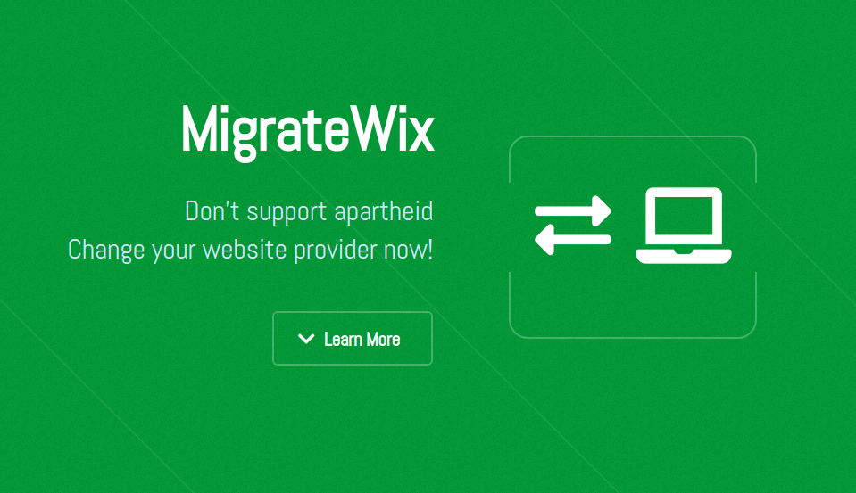

# Migrate Wix

This is the code for the Migrate Wix website.

MigrateWix is a campaign by concerned and motivated individuals to convince and encourage website owners to choose ethically when deciding on their website provider and hosting.

## Volunteer
We are always looking for volunteers!

Get in touch with me at bdsally3248[at]gmail.com

## Credits

Demo Images:
    Unsplash (unsplash.com)

Icons:
    Font Awesome (fontawesome.io)

Other:
    jQuery (jquery.com)
    Responsive Tools (github.com/ajlkn/responsive-tools)

Fractal by HTML5 UP
html5up.net | @ajlkn
Free for personal and commercial use under the CCA 3.0 license (html5up.net/license)
